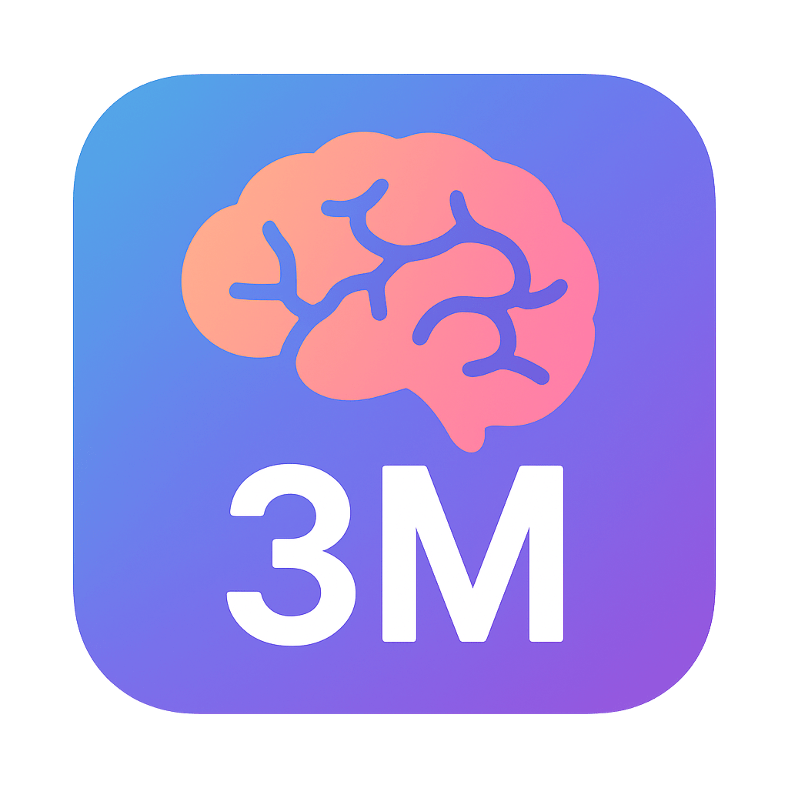

# 🧠 3M — *I Message to You About My Mind.*

> 精神的に混乱したとき、「何を言いたいのかわからない」と言われてしまう人のための思考整理・対話支援ツール。

---

## 🌱 概要

**3M**（読み：「スリーエム」 / I Message to You About My Mind）は、  
「自分の気持ちを整理して、相手に安全に伝える」ことをサポートする  
**6つのフェーズ構成**の自己表現支援アプリです。

特に、  
- 精神疾患や強いストレスで考えがまとまらないとき  
- 話しても誤解されてしまうとき  
- 衝動的に行動してしまう前に気持ちを整理したいとき  

に使用することを目的としています。

---

## 💡 コンセプト

> “I Message to You about My Mind.”  
> 自分の心の中を「Iメッセージ」で安全に伝える。

### 🧭 3つのM
1. **Mind** — 自分の気持ちをありのままに書き出す  
2. **Message** — 思考を5つ → 3つに整理し、優先度をつける  
3. **Move** — 伝える言葉としてまとめ、行動に移す  

---

## 🧩 フェーズ構成（6ステップ）

| フェーズ | 内容 | 使用タグ |
|-----------|-------|-----------|
| **1** | 感情や考えをありのまま書き出す | `<textarea>` |
| **2** | 文章を5つの要素に分解する | `<li>`, `<input>` |
| **3** | 緊急度と重要度で上位3つに絞る | `<li>`, `<input type="number">` |
| **4** | 3つの要素に優先順位をつける | `<li>`, `<input>` |
| **5** | 伝える文章を組み立てる | `<textarea>` |
| **6** | 最終メッセージを完成・コピー | `<div contenteditable>` |

---

## 🧠 使用方法

1. **フェーズ1**  
   思ったことを「ありのまま」書き出します。  
   感情・状況・体の調子など、まとまっていなくても大丈夫です。

2. **フェーズ2**  
   自動で文を分割し、5つの項目に整理します。  
   手動で追加・削除も可能です。

3. **フェーズ3**  
   各項目に「緊急性(0〜5)」と「重要性(0〜5)」を入力。  
   自動的にスコア上位3つを選出します。

4. **フェーズ4**  
   上位3つを上下ボタンで並べ替えて、伝える順番を決定します。

5. **フェーズ5**  
   各項目を短くまとめ、  
   「話の始まり（目的）」と「終わり（お願い・確認）」を追加します。

6. **フェーズ6**  
   最終メッセージを確認・コピー。  
   そのまま対話の場で使う、またはメモとして保存できます。

---

## ⚠️ セーフティ機能

- 「死にたい」「消えたい」などの**高リスクワードを自動検出**し、  
  ページ上部に緊急支援の案内を表示します。  
- 連絡先例：  
  - **119（救急） / 110（警察）**  
  - **いのちの電話**（全国各地）  
  - **TELL Lifeline（英語対応）: 03-5774-0992**

---

## 🧩 技術構成

- **HTML / CSS / JavaScript / HTMX** のみで構成された単一ページアプリ。  
- オフラインでも動作可能。  
- ローカル保存・サーバー通信なし（プライバシー保護）。  
- 主要機能：
  - テキスト分割 (`splitIntoPieces`)
  - スコア計算・自動ソート
  - コピー機能
  - 自殺関連ワード検知
  - 編集可能な最終出力（`contenteditable`）

---

## 💬 使用例

> 「最近、寝つきが悪くて、職場でうまく話せない」  
>  
> → 3Mで整理した結果：
>
> ```
> 今日は最近の体調と気持ちについて話したいです。
> 1. 夜眠れず、朝も疲れが取れない。
> 2. 職場でうまく話せず、孤立していると感じる。
> 3. サポートをお願いしたい。
> 聞いてくれてありがとうございます。どう思いますか？
> ```

---

## 🖊️ 業務上の報連相にも

> 「〇〇の業務で、やり方が分からず、自分で進めてしまって、エラーになってしまった。」
>
> → 3Mで整理した結果：
>
> ```
> 〇〇の業務について相談したいです。
> 1. 業務のやり方が分からなくなってしまった。
> 2. 相談のタイミングを逃し、自分で進めた。
> 3. エラーに対するサポートをお願いしたい。
> どうすればいいですか？
> ```

---

## 👥 想定ユーザー

- 精神疾患のある方（うつ病、双極性障害、統合失調症など）
- カウンセリング・リハビリ・自立訓練の現場
- 家族・支援者・相談員との対話支援

---

## 🛠 今後の拡張予定

- ✅ ローカル保存機能（IndexedDB）
- ✅ 音声入力サポート
- ✅ AIによる文章提案・構成補助
- ✅ メンタル状態を可視化するダッシュボード

---

## 📜 ライセンス

MIT License  
© 2025 Hirotoshi Uchida (Uchida16104)

---

## ❤️ クレジット

- Concept & Design: **Hirotoshi Uchida**  
- App Name: **3M — I Message to You About My Mind.**  
- Version: **1.0.0 (初期リリース)**  
- Category: **Mental Care / Self Expression Tool**

---
